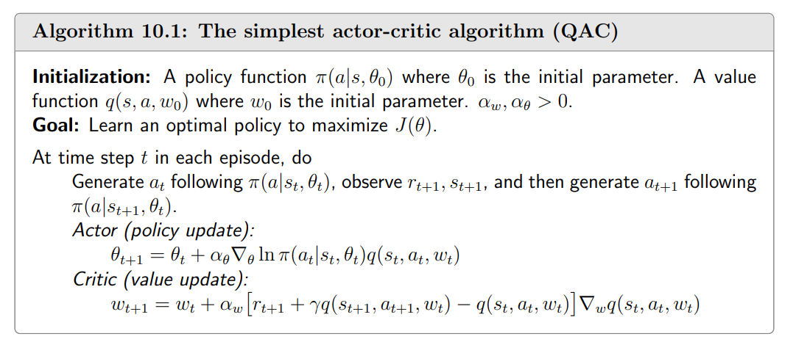
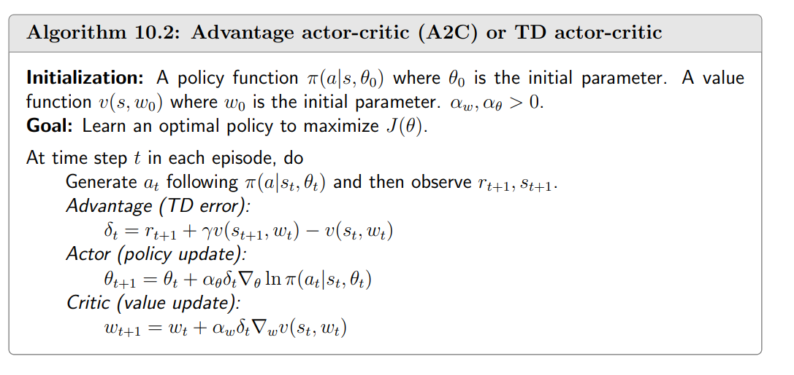
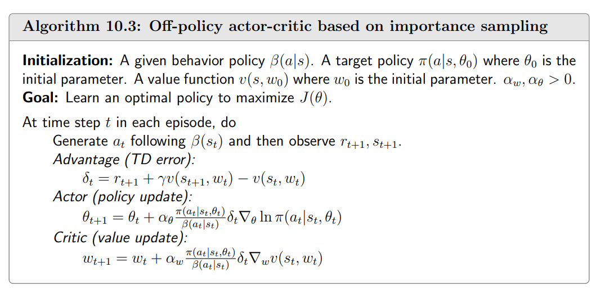
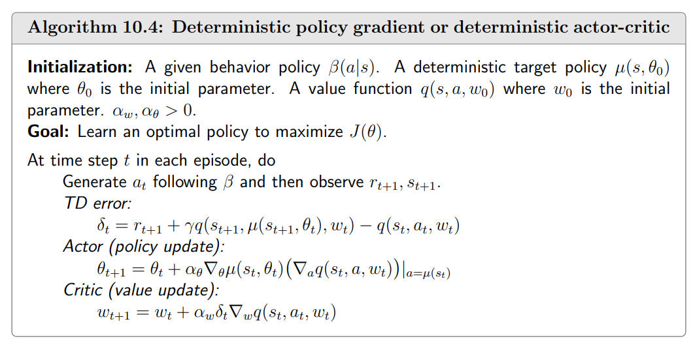

- “actor-critic” refers to a structure that incorporates both policy-based and value-based methods.
- An “actor” refers to a *policy update* step. 
- An “critic” refers to a *value update* step.

## 10.1 The simplest actor-critic algorithm (QAC)
The gradient-ascent algorithm for maximizing $J(θ)$ is
$$
\begin{aligned}
\theta_{t+1}& =\theta_t+\alpha\nabla_\theta J(\theta_t)  \\
&=\theta_t+\alpha\mathbb{E}_{S\sim\eta,A\sim\pi}\Big[\nabla_\theta\ln\pi(A|S,\theta_t)q_\pi(S,A)\Big],
\end{aligned}
$$
where $η$ is a distribution of the states. Since the true gradient is unknown, we can use a stochastic gradient to approximate it:
$$
\theta_{t+1}=\theta_t+\alpha\nabla_\theta\ln\pi(a_t|s_t,\theta_t)q_t(s_t,a_t).
$$
- If $q_t(s_t,a_t)$ is estimated by Monte Carlo learning, the corresponding algorithm is called *REINFORCE* or *Monte Carlo policy gradient*.
-  If $q_t(s_t,a_t)$ is estimated by TD learning, the corresponding algorithms are usually called *actor-critic*. Therefore, actor-critic methods can be obtained by incorporating TD-based value estimation into policy gradient methods.

The critic corresponds to the value update step via the Sarsa algorithm. This actor-citric algorithm is sometimes called $Q$ *actor-critic* (QAC).

## 10.2 Advantage actor-critic (A2C)
The core idea of this algorithm is to introduce a baseline to reduce estimation variance.
### Baseline invariance
One interesting property of the **policy gradient** is that it is *invariant to an additional baseline*.
$$
\mathbb{E}_{S\sim\eta,A\sim\pi}\Big[\nabla_\theta\ln\pi(A|S,\theta_t)q_\pi(S,A)\Big]=\mathbb{E}_{S\sim\eta,A\sim\pi}\Big[\nabla_\theta\ln\pi(A|S,\theta_t)(q_\pi(S,A)-b(S))\Big],
$$
where the additional baseline $b(S)$ is a scalar function of $S$.

Why useful? 
It can reduce the **approximation variance** when we use samples to approximate the true gradient.
$$
X(S,A)\doteq\nabla_\theta\ln\pi(A|S,\theta_t)[q_\pi(S,A)-b(S)]
$$
Then, the true gradient is $\mathbb{E}[X(S, A)]$. However, the variance $\text{var}(X)$ will change.

Optimal baseline that minimizes variance:
$$
b^*(s)=\frac{\mathbb{E}_{A\sim\pi}\big[\|\nabla_\theta\ln\pi(A\|s,\theta_t)\|^2q_\pi(s,A)\big]}{\mathbb{E}_{A\sim\pi}\big[\|\nabla_\theta\ln\pi(A|s,\theta_t)\|^2\big]},\quad s\in\mathcal{S}
$$
Suboptimal baseline (simpler):
$$
b^\dagger(s)=\mathbb{E}_{A\sim\pi}[q_\pi(s,A)]=v_\pi(s),\quad s\in\mathcal{S}.
$$
which is the state value.
### Algorithm description
When $b(s) = v_{\pi}(s)$, the gradient-ascent algorithm becomes
$$
\begin{gathered}
\theta_{t+1} =\theta_t+\alpha\mathbb{E}\Big[\nabla_\theta\ln\pi(A|S,\theta_t)[q_\pi(S,A)-v_\pi(S)]\Big] \\
\doteq\theta_t+\alpha\mathbb{E}\bigg[\nabla_\theta\ln\pi(A|S,\theta_t)\delta_\pi(S,A)\bigg]. 
\end{gathered}
$$
Here,
$$
\delta_\pi(S,A)\doteq q_\pi(S,A)-v_\pi(S)
$$
is called the *advantage function*.

The stochastic version is 
$$
\theta_{t+1}=\theta_t+\alpha\nabla_\theta\ln\pi(a_t|s_t,\theta_t)[q_t(s_t,a_t)-v_t(s_t)]\\=\theta_t+\alpha\nabla_\theta\ln\pi(a_t|s_t,\theta_t)\delta_t(s_t,a_t),
$$
where $s_{t}$ , $a_{t}$ are samples of $S$, $A$ at time $t$.

The algorithm is as follows:

The advantage function is approximated by the TD error:
$$
q_t(s_t,a_t)-v_t(s_t)\approx r_{t+1}+\gamma v_t(s_{t+1})-v_t(s_t).
$$
## 10.3 Off-policy actor-critic
### Importance sampling
Consider a random variable $X\in\mathcal{X}$. Suppose that $p_0(X)$ is a probability distribution. Our goal is to estimate $\mathbb{E}_{X\sim p_0}[X].$ Suppose that we have some i.i.d. samples $\{x_i\}_i=1^n.$ 

If they are generated by another distribution $p_{1}$.
$$
\mathbb{E}_{X\sim p_0}[X]=\sum_{x\in\mathcal{X}}p_0(x)x=\sum_{x\in\mathcal{X}}p_1(x)\underbrace{\frac{p_0(x)}{p_1(x)}x}_{f(x)}=\mathbb{E}_{X\sim p_1}[f(X)].
$$
Thus, estimating $\mathbb{E}_X\sim p_0[X]$ becomes the problem of estimating $\mathbb{E}_X\sim p_1[f(X)].$ Let
$$
\bar{f}\doteq\frac1n\sum_{i=1}^nf(x_i).
$$
Since $\bar{f}$ can effectively approximate $\mathbb{E}_X\sim p_1[f(X)]$, then we have
$$
\mathbb{E}_{X\sim p_0}[X]=\mathbb{E}_{X\sim p_1}[f(X)]\approx\bar{f}=\frac{1}{n}\sum_{i=1}^{n}f(x_{i})=\frac{1}{n}\sum_{i=1}^{n}\underbrace{\frac{p_0(x_i)}{p_1(x_i)}}_{\text{importance}\atop\text{weight}}x_{i}.
$$
### The off-policy policy gradient theorem
Suppose that $\beta$ is a behavior policy. Our goal is to use the samples generated by $\beta$ to learn a target policy $\pi$ that can maximize the following metric:
$$
J(\theta)=\sum_{s\in\mathcal{S}}d_\beta(s)v_\pi(s)=\mathbb{E}_{S\sim d_\beta}[v_\pi(S)],
$$
where $d_{\beta}$ is the stationary distribution under policy $\beta$ and $v_\pi$ is the state value under policy $\pi.$ The gradient of this metric is given in the following theorem.

**Theorem 10.1** (Off-policy policy gradient theorem). In the discounted case where $\gamma \in ( 0, 1)$
the gradient of  $J(\theta)$ is
$$
\nabla_{\theta}J(\theta)=\mathbb{E}_{S\sim\rho,A\sim\beta}\bigg[\underbrace{\frac{\pi(A|S,\theta)}{\beta(A|S)}}_{importance}\nabla_{\theta}\ln\pi(A|S,\theta)q_{\pi}(S,A)\bigg],
$$
where the state distribution is
$$
\rho(s)\doteq\sum_{s'\in\mathcal{S}}d_\beta(s')\mathrm{Pr}_\pi(s|s'),\quad s\in\mathcal{S},
$$
where$\mathrm{~Pr}_{\pi }( s| s^{\prime }) = \sum _{k= 0}^{\infty }\gamma ^{k}[ P_{\pi }^{k}] _{s^{\prime }s}= \left [ ( I- \gamma P_{\pi }) ^{- 1}\right ] _{s^{\prime }s}$is the discounted total probability of 
transitioning from $s'$  to $s$ under policy $\pi$.

### Algorithm description
The gradient is
$$
\nabla_\theta J(\theta)=\mathbb{E}\left[\frac{\pi(A|S,\theta)}{\beta(A|S)}\nabla_\theta\ln\pi(A|S,\theta)\big(q_\pi(S,A)-v_\pi(S)\big)\right].
$$
The corresponding stochastic gradient-ascent algorithm is
$$
\theta_{t+1}=\theta_t+\alpha_\theta\frac{\pi(a_t|s_t,\theta_t)}{\beta(a_t|s_t)}\nabla_\theta\ln\pi(a_t|s_t,\theta_t)\big(q_t(s_t,a_t)-v_t(s_t)\big),
$$
where $\alpha_{\theta}>0$.

## 10.4 Deterministic actor-critic
It is important to study the deterministic case since it is naturally **off-policy** and can effectively handle **continuous action spaces**.

In this section, we use
$$
a=\mu(s, \theta)
$$
to specifically denote a deterministic policy.

### The deterministic policy gradient theorem
### Algorithm description
We can apply the gradient-ascent algorithm to maximize $J(θ)$:
$$
\theta_{t+1}=\theta_t+\alpha_\theta\mathbb{E}_{S\sim\eta}\begin{bmatrix}\nabla_\theta\mu(S)\big(\nabla_aq_\mu(S,a)\big)|_{a=\mu(S)}\end{bmatrix}.
$$
The corresponding stochastic gradient-ascent algorithm is
$$
\theta_{t+1}=\theta_t+\alpha_\theta\nabla_\theta\mu(s_t)\big(\nabla_aq_\mu(s_t,a)\big)|_{a=\mu(s_t)}.
$$
It should be noted that this algorithm is *off-policy* since the behavior policy $β$ may be different from $\mu$.

