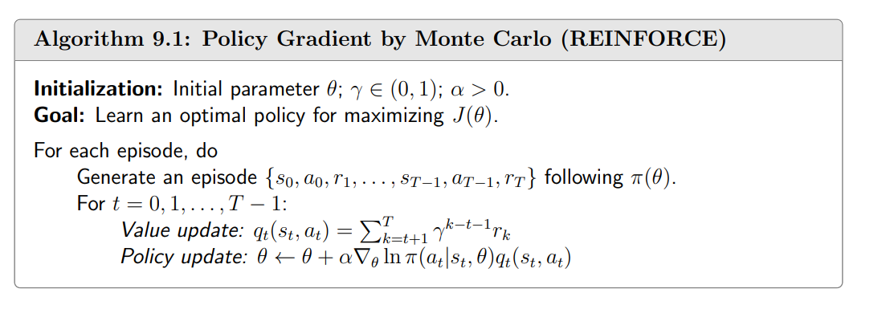
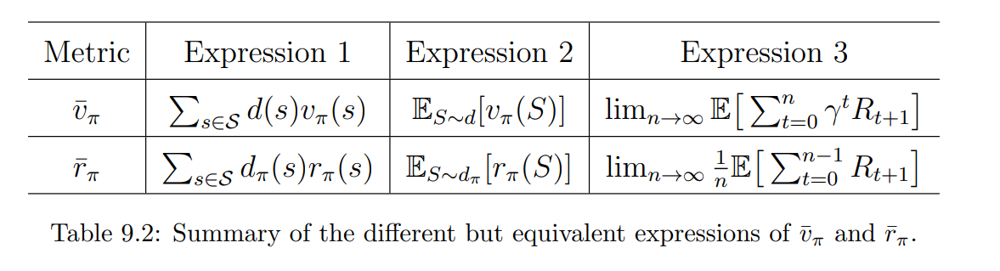

Policies can be represented by parameterized functions denoted as $π(a|s, θ)$, where $θ\in \mathbb{R}^{m}$ is a parameter vector.

When policies are represented as functions, optimal policies can be obtained by optimizing certain scalar metrics. Such a method is called *policy gradient*. 

## 9.1 Policy representation: From table to function
- how to define optimal policies? maximize every state value. maximize certain scalar metrics.
- how to update a policy? changing the entries in the table; changing the parameter $θ$.
- how to retrieve the probability of an action? looking up the corresponding entry in the table; 

Suppose that $J(\theta)$ is a scalar metric. Then optimal policies can be obtained by
$$
\theta_{t+1}=\theta_t+\alpha\nabla_\theta J(\theta_t)
$$
where $\nabla_{\theta}J$ is the gradient of $J$ with respect to $θ$, $t$ is the time step, and $α$ is the optimization rate.
## 9.2 Metrics for defining optimal policies
### Metric 1: Average state value
$$
\bar{v}_\pi=\sum_{s\in\mathcal{S}}d(s)v_\pi(s),
$$
where $d(s)$ is the weight of state $s.$ It satisfies $d(s)\geq0$ for any $s\in\mathcal{S}$ and $\sum_s\in\mathcal{S}d(s)=1.$ Therefore, we can interpret $d(s)$ as a probability distribution of $s.$ Then, the metric can be written as
$$
\bar{v}_\pi=\mathbb{E}_{S\sim d}[v_\pi(S)].
$$
#### How to select the distribution $d$?
- $d$ is *independent* of the policy $\pi$. 
  - Treat all the states equally important and select $d_0(s)=$ $1/|\mathcal{S}|.$ 
  - We are only interested in a specific state $s_0$ (e.g., the agent always starts from $s_0).$ In this case, we can design $$d_0(s_0)=1,\quad d_0(s\neq s_0)=0.$$
- $d$ is *dependent* on the policy $\pi$. it is common to select $d$ as $d_\pi$, which is the *stationary distribution* under $\pi$. One basic property of $d_\pi$ is that it satisfies $$d_\pi^TP_\pi=d_\pi^T,$$ where $P_\pi$ is the state transition probability matrix.
#### two important equivalent expressions of $\overline{v}_{\pi}$.
**First one**
$$
J(\theta)=\lim_{n\to\infty}\mathbb{E}\left[\sum_{t=0}^n\gamma^tR_{t+1}\right]=\mathbb{E}\left[\sum_{t=0}^\infty\gamma^tR_{t+1}\right].
$$
Which is easy to show:
$$
\begin{aligned}
\mathbb{E}\left[\sum_{t=0}^\infty\gamma^tR_{t+1}\right]& \begin{aligned}=\sum_{s\in\mathcal{S}}d(s)\mathbb{E}\left[\sum_{t=0}^\infty\gamma^tR_{t+1}|S_0=s\right]\end{aligned}  \\
&=\sum_{s\in\mathcal{S}}d(s)v_\pi(s) \\
&=\bar{v}_{\pi}.
\end{aligned}
$$
**Second one**
$$
\overline{v}_{\pi}=d^{T}v_{\pi}.
$$
### Metric 2: Average reward
$$
\begin{aligned}\bar{r}_{\pi}&\doteq\sum_{s\in\mathcal{S}}d_\pi(s)r_\pi(s)\\&=\mathbb{E}_{S\sim d_\pi}[r_\pi(S)],\end{aligned}
$$
where $d_{\pi}$ is the stationary distribution and
$$
r_\pi(s)\doteq\sum_{a\in\mathcal{A}}\pi(a|s,\theta)r(s,a)=\mathbb{E}_{A\sim\pi(s,\theta)}[r(s,A)|s]
$$
is the expectation of the immediate rewards. Here, $r(s,a)\doteq\mathbb{E}[R|s,a]=\sum_rrp(r|s,a)$.
#### two important equivalent expressions of $\overline{r}_{\pi}$
**First one**
$$
J(\theta)=\lim_{n\to\infty}\frac1n\mathbb{E}\left[\sum_{t=0}^{n-1}R_{t+1}\right].
$$
It is easy to show that
$$
\lim_{n\to\infty}\frac{1}{n}\mathbb{E}\left[\sum_{t=0}^{n-1}R_{t+1}\right]=\sum_{s\in\mathcal{S}}d_\pi(s)r_\pi(s)=\bar{r}_\pi.
$$
**Second one**
$$
\bar{r}_\pi=\sum_{s\in\mathcal{S}}d_\pi(s)r_\pi(s)=d_\pi^Tr_\pi.
$$
### Summary

The two metrics $\bar{v}_\pi$ and $\bar{r}_\pi$ are equivalent in the discounted case where $\gamma<1.$ In particular, it can be shown that
$$
\bar{r}_\pi=(1-\gamma)\bar{v}_\pi.
$$
## 9.3 Gradients of the metrics

## 9.4 Monte Carlo policy gradient (REINFORCE)
The gradient-ascent algorithm for maximizing $J(\theta)$ is
$$
\begin{aligned}\theta_{t+1}&=\theta_t+\alpha\nabla_\theta J(\theta_t)\\&=\theta_t+\alpha\mathbb{E}\Big[\nabla_\theta\ln\pi(A|S,\theta_t)q_\pi(S,A)\Big],\end{aligned}
$$
where $\alpha>0$ is a constant learning rate. Since the true gradient is unknown, we can replace the true gradient with a stochastic gradient to obtain the following algorithm:
$$
\theta_{t+1}=\theta_t+\alpha\nabla_\theta\ln\pi(a_t|s_t,\theta_t)q_t(s_t,a_t),
$$
where $q_t(s_t,a_t)$ is an approximation of $q_\pi(s_t,a_t).$ If $q_t(s_t,a_t)$ is obtained by Monte Carlo estimation, the algorithm is called *REINFORCE* or *Monte Carlo policy gradient* which is one of earliest and simplest policy gradient algorithms.

Since $\nabla_\theta\ln\pi(a_t|s_t,\theta_t)=\frac{\nabla_\theta\pi(a_t|s_t,\theta_t)}{\pi(a_t|s_t,\theta_t)}$, we have
$$
\theta_{t+1}=\theta_t+\alpha\underbrace{\left(\frac{q_t(s_t,a_t)}{\pi(a_t|s_t,\theta_t)}\right)}_{\beta_t}\nabla_\theta\pi(a_t|s_t,\theta_t),
$$
Which can be further written concisely as 
$$
\theta_{t+1}=\theta_t+\alpha\beta_t\nabla_\theta\pi(a_t|s_t,\theta_t).
$$
It is clear that $\pi(a_t|s_t,\theta_{t+1})\geq\pi(a_t|s_t,\theta_t)$ when $\beta_t\geq0$ and $\pi(a_t|s_t,\theta_{t+1})<\pi(a_t|s_t,\theta_t)$ when $\beta_t<0$.

Unfortunately, the ideal ways for sampling S and A are not strictly followed in practice due to their low efficiency of sample usage. A more sample-efficient implementation is given

