Diffusion models are *incremental* updates where the assembly of the whole gives us the encoder-decoder structure. The transition from one state to another is realized by a denoiser.

**Structure**
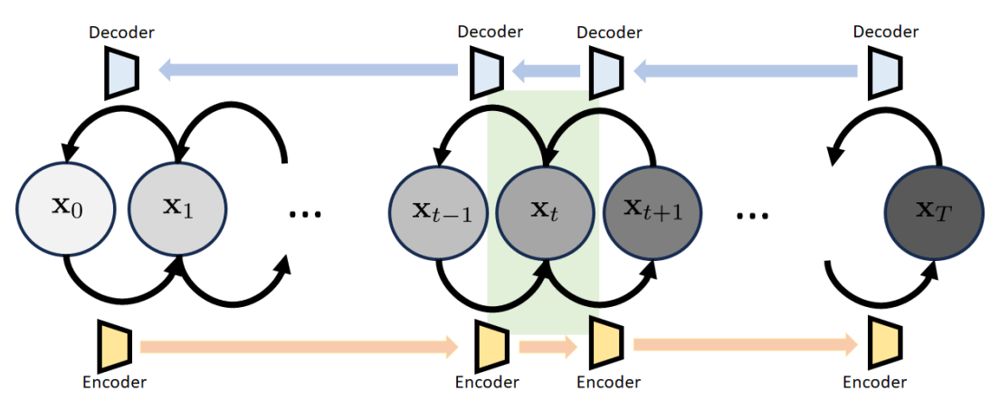
It is called the **variational diffusion model**. The variational diffusion model has a sequence of states  $\mathbf{x}_{0},\mathbf{x}_{1},\dots,\mathbf{x}_{T}$ :
- $\mathbf{x}_{0}$: the original image
- $\mathbf{x}_{T}$: the latent variable. We want $\mathbf{x}_{T}\sim \mathcal{N}(0, \mathbf{I})$.
- $\mathbf{x}_{1},\dots,\mathbf{x}_{T-1}$: the intermediate states. 
## 1 Building Blocks
### Transition Block
The $t$-th transition block consists of three states $\mathbf{x}_{t-1},\mathbf{x}_{t}$, and $\mathbf{x_{t+1}}$.
- *The forward transition* ( $\mathbf{x}_{t-1}\to \mathbf{x}_{t}$ ). Transition distribution $p(\mathbf{x}_{t}|\mathbf{x}_{t−1})$. We approximate it by a **Gaussian** $q_{\phi}(\mathbf{x}_{t}|\mathbf{x}_{t-1})$.
- *The reverse transition* $\mathbf{x}_{t+1} \to \mathbf{x}_{t}$. Transition distribution $p(\mathbf{x}_{t+1}|\mathbf{x}_{t})$. Use another Gaussian $p_{\theta}(\mathbf{x}_{t+1}|\mathbf{x}_{t})$ to approximate it (**neural network**).

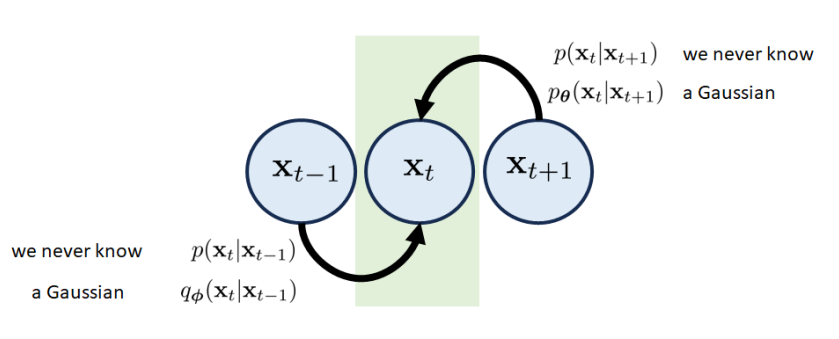

### Initial Block: $\mathbf{x}_{0}$
We only need to worry about $p(\mathbf{x}_{0}|\mathbf{x}_{1})$ and approximate it by a Gaussian $p_{\theta}(\mathbf{x}_{0}|\mathbf{x}_{1})$ where the **mean** is computed through a **neural network**.

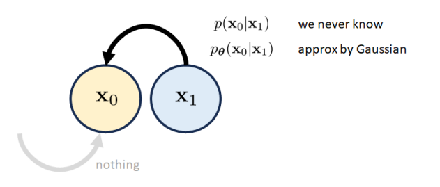
### Final Block: $\mathbf{x}_{T}$
It should be a white Gaussian noise vector. The forward transition is approximated by $q_{\phi}(\mathbf{x}_{T} |\mathbf{x}_{T-1})$, which is a **Gaussian**.

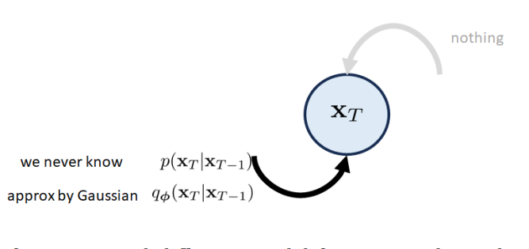
### Understanding the Transition Distribution $q_{\phi}(\mathbf{x}_{t}|\mathbf{x}_{t-1})$
In a DDPM model, the transition distribution $q_{\phi}(\mathbf{x}_{t}|\mathbf{x}_{t-1})$ is defined as 
$$
q_{\boldsymbol{\phi}}(\mathbf{x}_t|\mathbf{x}_{t-1})\stackrel{\mathrm{def}}{=}\mathcal{N}(\mathbf{x}_t|\sqrt{\alpha_t}\mathbf{x}_{t-1},(1-\alpha_t)\mathbf{I})
$$
- The scaling factor $\sqrt{ \alpha_{t} }$ is to make sure that the variance magnitude is preserved so that it will not explode and vanish after many iterations.
- It also means $\mathbf{x}_{t} = \sqrt{ \alpha_{t} }\mathbf{x}_{t-1}+\sqrt{ 1-\alpha_{t} }\epsilon_{t-1}$, $\epsilon_{t-1}\sim \mathcal{N}(0,\mathbf{I})$.
## 2 The magical scalars $\sqrt{ \alpha_{t} }$ and $1-\alpha_{t}$
Why $\sqrt{ \alpha_{t} }$ and $1-\alpha_{t}$? Let's define the transition distribution as 
$$
q_{\boldsymbol{\phi}}(\mathbf{x}_t|\mathbf{x}_{t-1})=\mathcal{N}(\mathbf{x}_t|a\mathbf{x}_{t-1},b^2\mathbf{I}).
$$
where $a \in \mathbb{R}, b \in \mathbb{R}$.

**Proof.**
First, we have 
$$
\mathbf{x}_t=a\mathbf{x}_{t-1}+b\boldsymbol{\epsilon}_{t-1},\quad\mathrm{where}\quad\boldsymbol{\epsilon}_{t-1}\sim\mathcal{N}(0,\mathbf{I}).
$$
Then, we carry on the recursion
$$
\begin{aligned}
\mathbf{x}_{t}& =a\mathbf{x}_{t-1}+b\boldsymbol{\epsilon}_{t-1}  \\
&=a(a\mathbf{x}_{t-2}+b\boldsymbol{\epsilon}_{t-2})+b\boldsymbol{\epsilon}_{t-1} \\
&=a^2\mathbf{x}_{t-2}+ab\boldsymbol{\epsilon}_{t-2}+b\boldsymbol{\epsilon}_{t-1} \\
&=: \\
&=a^t\mathbf{x}_0+b\underbrace{\left[\boldsymbol{\epsilon}_{t-1}+a\boldsymbol{\epsilon}_{t-2}+a^2\boldsymbol{\epsilon}_{t-3}+\ldots+a^{t-1}\boldsymbol{\epsilon}_0\right]}_{\overset{\mathrm{def}}{\operatorname*{=}}\mathbf{w}_t}.
\end{aligned}
$$
It is clear that $\mathbb{E}[\mathbf{w}_{t}]=0$.The covariance matrix
$$
\begin{aligned}
\mathrm{Cov}[\mathbf{w}_{t}]&\stackrel{\mathrm{def}}{=} b^{2}(\mathrm{Cov}(\boldsymbol{\epsilon}_{t-1})+a^{2}\mathrm{Cov}(\boldsymbol{\epsilon}_{t-2})+\ldots+(a^{t-1})^{2}\mathrm{Cov}(\boldsymbol{\epsilon}_{0}))  \\
&=b^2(1+a^2+a^4+\ldots+a^{2(t-1)})\mathbf{I} \\
&=b^2\cdot\frac{1-a^{2t}}{1-a^2}\mathbf{I}.
\end{aligned}
$$
As $t\to\infty,a^t\to0$ for any $0<a<1.$ Therefore, at the limit when $t=\infty$,
$$\lim\limits_{t\to\infty}\mathrm{Cov}[\mathbf{w}_t]=\frac{b^2}{1-a^2}\mathbf{I}.$$
So, if we want $\lim_{t\to\infty}\text{Cov}[\mathbf{w}_t]=\mathbf{I}$ (so that the distribution of $\mathbf{x}_t$ will approach $\mathcal{N}(0,\mathbf{I})$, then $b=\sqrt{1-a^{2}}$.

Now, if we let $a=\sqrt{\alpha}$, then $b=\sqrt1-\alpha.$ This will give us
$$
\mathbf{x}_t=\sqrt{\alpha}\mathbf{x}_{t-1}+\sqrt{1-\alpha}\boldsymbol{\epsilon}_{t-1}
$$
Or equivalently, $q_{\boldsymbol{\phi}}(\mathbf{x}|\mathbf{x}_{t-1})=\mathcal{N}(\mathbf{x}_{t}\mid\sqrt{\alpha}\mathbf{x}_{t-1},(1-\alpha)\mathbf{I}).$ You can replace $\alpha$ by $\alpha_t$, if you prefer a
scheduler.
## 3 Distribution $q_{\phi}(\mathbf{x}_{t}|\mathbf{x}_{0})$
Conditional distribution $q_{\phi}(\mathbf{x}_{t}|\mathbf{x}_{0})$
$$
q_{\boldsymbol{\phi}}(\mathbf{x}_{t}|\mathbf{x}_{0})=\mathcal{N}(\mathbf{x}_{t}\mid\sqrt{\overline{\alpha}_{t}}\mathbf{x}_{0},(1-\overline{\alpha}_{t})\mathbf{I}),
$$
where $\overline{\alpha}_{t}=\prod_{i=1}^{t}\alpha_{i}$.

**Proof.**
$$
\begin{aligned}\mathbf{x}_{t}&=\sqrt{\alpha_t}\mathbf{x}_{t-1}+\sqrt{1-\alpha_t}\boldsymbol{\epsilon}_{t-1}\\&=\sqrt{\alpha_t}(\sqrt{\alpha_{t-1}}\mathbf{x}_{t-2}+\sqrt{1-\alpha_{t-1}}\boldsymbol{\epsilon}_{t-2})+\sqrt{1-\alpha_t}\boldsymbol{\epsilon}_{t-1}\\&=\sqrt{\alpha_t\alpha_{t-1}}\mathbf{x}_{t-2}+\underbrace{\sqrt{\alpha_t}\sqrt{1-\alpha_{t-1}}\boldsymbol{\epsilon}_{t-2}+\sqrt{1-\alpha_t}\boldsymbol{\epsilon}_{t-1}}_{\mathbf{w}_1}.\end{aligned}
$$
The new covariance is
$$
\begin{aligned}\mathbb{E}[\mathbf{w}_{1}\mathbf{w}_{1}^{T}]&=[(\sqrt{\alpha_{t}}\sqrt{1-\alpha_{t-1}})^{2}+(\sqrt{1-\alpha_{t}})^{2}]\mathbf{I}\\&=[\alpha_t(1-\alpha_{t-1})+1-\alpha_t]\mathbf{I}=[1-\alpha_t\alpha_{t-1}]\mathbf{I}.\end{aligned}
$$
We can show that the recursion is updated to become a linear combination of
$\mathbf{x}_{t-2}$ and a noise vector $\boldsymbol\epsilon_t-2:$
$$
\begin{aligned}\mathbf{x}_{t}&=\sqrt{\alpha_{t}\alpha_{t-1}}\mathbf{x}_{t-2}+\sqrt{1-\alpha_{t}\alpha_{t-1}}\boldsymbol{\epsilon}_{t-2}\\&=\sqrt{\alpha_{t}\alpha_{t-1}\alpha_{t-2}}\mathbf{x}_{t-3}+\sqrt{1-\alpha_{t}\alpha_{t-1}\alpha_{t-2}}\boldsymbol{\epsilon}_{t-3}\\&=\vdots\\&=\sqrt{\prod_{i=1}^t\alpha_i}\mathbf{x}_0+\sqrt{1-\prod_{i=1}^t\alpha_i}\boldsymbol{\epsilon}_0.\end{aligned}
$$
So, if we define $\overline{\alpha}_t=\prod_{i=1}^t\alpha_i$, we can show that
$$
\mathbf{x}_{t}=\sqrt{\overline{\alpha}_{t}}\mathbf{x}_{0}+\sqrt{1-\overline{\alpha}_{t}}\epsilon_{0}.
$$
In other words, the distribution $q_{\boldsymbol{\phi}}(\mathbf{x}_{t}|\mathbf{x}_{0})$ is
$$
\mathbf{x}_t\sim q_{\boldsymbol{\phi}}(\mathbf{x}_t|\mathbf{x}_0)=\mathcal{N}(\mathbf{x}_t\:|\:\sqrt{\overline{\alpha}_t}\mathbf{x}_0,\:(1-\overline{\alpha}_t)\mathbf{I}).
$$
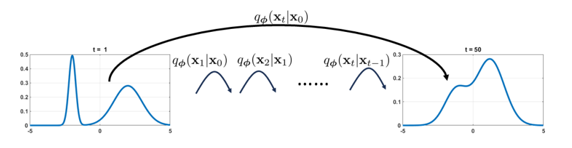

## 4 Evidence Lower Bound
The ELBO for the variational diffusion model is
$$
\begin{aligned}
\mathrm{ELBO}_{\phi,\theta}(\mathbf{x})= &\mathbb{E}_{q_{\boldsymbol{\phi}}(\mathbf{x}_{1}|\mathbf{x}_{0})}\bigg[\log\underbrace{p_{\boldsymbol{\theta}}(\mathbf{x}_{0}|\mathbf{x}_{1})}_{\mathrm{how~good~the~initial~block~is}}\bigg]  \\
&-\mathbb{E}_{q_{\boldsymbol{\phi}}(\mathbf{x}_{T-1}|\mathbf{x}_{0})}\left[\underbrace{\mathbb{D}_{\mathrm{KL}}\left(q_{\boldsymbol{\phi}}(\mathbf{x}_{T}|\mathbf{x}_{T-1})\|p(\mathbf{x}_{T})\right)}_{\text{how good the final block is}}\right] \\
&-\sum_{t=1}^{T-1}\mathbb{E}_{q_{\boldsymbol{\phi}}(\mathbf{x}_{t-1},\mathbf{x}_{t+1}|\mathbf{x}_{0})}\Big[\underbrace{\mathbb{D}_{\mathrm{KL}}\Big(q_{\boldsymbol{\phi}}(\mathbf{x}_{t}|\mathbf{x}_{t-1})\|p_{\boldsymbol{\theta}}(\mathbf{x}_{t}|\mathbf{x}_{t+1})\Big)}_{\mathrm{how~good~the~transition~blocks~are}}\Big]
\end{aligned}
$$
Interpretation of ELBO:
- **Reconstruction.** Use log-likelihood $p_{\theta}(\mathbf{x}_{0}|\mathbf{x}_{1})$ to measure.
- **Prior Matching.** Use KL divergence to measure the difference between $q_{\phi}(\mathbf{x}_{T}|\mathbf{x}_{T −1})$ and $p(\mathbf{x}_{T})$.
- **Consistency.** The *forward transition* is determined by the distribution $q_{\phi}(\mathbf{x}_{t}|\mathbf{x}_{t-1})$ whereas the *reverse transition* is determined by the neural network $p_{\boldsymbol{\theta}}(\mathbf{x}_{t}|\mathbf{x}_{t+1}).$ The consistency term uses the *KL divergence* to measure the deviation.

**Proof.**
$$
\begin{aligned}
\operatorname{log}p(\mathbf{x})& =\log p(\mathbf{x}_{0})  \\
&=\log\int p(\mathbf{x}_{0:T})d\mathbf{x}_{1:T} \\
&=\log\int p(\mathbf{x}_{0:T})\frac{q_{\boldsymbol{\phi}}(\mathbf{x}_{1:T}|\mathbf{x}_{0})}{q_{\boldsymbol{\phi}}(\mathbf{x}_{1:T}|\mathbf{x}_{0})}d\mathbf{x}_{1:T} \\
&=\log\int q_{\boldsymbol{\phi}}(\mathbf{x}_{1:T}|\mathbf{x}_{0})\left[\frac{p(\mathbf{x}_{0:T})}{q_{\boldsymbol{\phi}}(\mathbf{x}_{1:T}|\mathbf{x}_{0})}\right]d\mathbf{x}_{1:T} \\
&=\log\mathbb{E}_{q_{\boldsymbol{\phi}}(\mathbf{x}_{1:T}|\mathbf{x}_{0})}\left[\frac{p(\mathbf{x}_{0:T})}{q_{\boldsymbol{\phi}}(\mathbf{x}_{1:T}|\mathbf{x}_{0})}\right]\\
&\geq \mathbb{E}_{q_{\boldsymbol{\phi}}(\mathbf{x}_{1:T}|\mathbf{x}_{0})}\left[\log\frac{p(\mathbf{x}_{0:T})}{q_{\boldsymbol{\phi}}(\mathbf{x}_{1:T}|\mathbf{x}_{0})}\right]
\end{aligned}
$$
The last inequality follows from Jensen's inequality.
Note that
$$
p(\mathbf{x}_{0:T})=p(\mathbf{x}_T)\prod_{t=1}^Tp(\mathbf{x}_{t-1}|\mathbf{x}_t)=p(\mathbf{x}_T)p(\mathbf{x}_0|\mathbf{x}_1)\prod_{t=2}^Tp(\mathbf{x}_{t-1}|\mathbf{x}_t)
$$
$$
q_{\boldsymbol{\phi}}(\mathbf{x}_{1:T}|\mathbf{x}_0)=\prod_{t=1}^Tq_{\boldsymbol{\phi}}(\mathbf{x}_t|\mathbf{x}_{t-1})=q_{\boldsymbol{\phi}}(\mathbf{x}_T|\mathbf{x}_{T-1})\prod_{t=1}^{T-1}q_{\boldsymbol{\phi}}(\mathbf{x}_t|\mathbf{x}_{t-1}).
$$
Then
$$
\begin{aligned}
\operatorname{log}p(\mathbf{x})& \geq\mathbb{E}_{q_{\boldsymbol{\phi}}(\mathbf{x}_{1:T}|\mathbf{x}_{0})}\left[\log\frac{p(\mathbf{x}_{0:T})}{q_{\boldsymbol{\phi}}(\mathbf{x}_{1:T}|\mathbf{x}_{0})}\right]  \\
&=\mathbb{E}_{q_{\boldsymbol{\phi}}(\mathbf{x}_{1:T}|\mathbf{x}_0)}\left[\log\frac{p(\mathbf{x}_T)p(\mathbf{x}_0|\mathbf{x}_1)\prod_{t=2}^Tp(\mathbf{x}_{t-1}|\mathbf{x}_t)}{q_{\boldsymbol{\phi}}(\mathbf{x}_T|\mathbf{x}_{T-1})\prod_{t=1}^{T-1}q_{\boldsymbol{\phi}}(\mathbf{x}_t|\mathbf{x}_{t-1})}\right] \\
&=\mathbb{E}_{q_{\boldsymbol{\phi}}(\mathbf{x}_{1:T}|\mathbf{x}_0)}\left[\log\frac{p(\mathbf{x}_T)p(\mathbf{x}_0|\mathbf{x}_1)\prod_{t=1}^{T-1}p(\mathbf{x}_t|\mathbf{x}_{t+1})}{q_{\boldsymbol{\phi}}(\mathbf{x}_T|\mathbf{x}_{T-1})\prod_{t=1}^{T-1}q_{\boldsymbol{\phi}}(\mathbf{x}_t|\mathbf{x}_{t-1})}\right] \\
&=\mathbb{E}_{q_{\boldsymbol{\phi}}(\mathbf{x}_{1:T}|\mathbf{x}_{0})}\left[\log\frac{p(\mathbf{x}_{T})p(\mathbf{x}_{0}|\mathbf{x}_{1})}{q_{\boldsymbol{\phi}}(\mathbf{x}_{T}|\mathbf{x}_{T-1})}\right]+\mathbb{E}_{q_{\boldsymbol{\phi}}(\mathbf{x}_{1:T}|\mathbf{x}_{0})}\left[\log\prod_{t=1}^{T-1}\frac{p(\mathbf{x}_{t}|\mathbf{x}_{t+1})}{q_{\boldsymbol{\phi}}(\mathbf{x}_{t}|\mathbf{x}_{t-1})}\right]
\end{aligned}
$$
The Reconstruction term can be simplified as
$$
\mathbb{E}_{q_{\boldsymbol{\phi}}(\mathbf{x}_{1:T}|\mathbf{x}_0)}\bigg[\log p(\mathbf{x}_0|\mathbf{x}_1)\bigg]=\mathbb{E}_{q_{\boldsymbol{\phi}}(\mathbf{x}_1|\mathbf{x}_0)}\bigg[\log p(\mathbf{x}_0|\mathbf{x}_1)\bigg],
$$
where we used the fact that the conditioning $\mathbf{x}_1:T|\mathbf{x}_0$ is equivalent to $\mathbf{x}_1|\mathbf{x}_0.$
The Prior Matching term is
$$
\begin{aligned}\mathbb{E}_{q_{\boldsymbol{\phi}}(\mathbf{x}_{1:T}|\mathbf{x}_{0})}\left[\log\frac{p(\mathbf{x}_{T})}{q_{\boldsymbol{\phi}}(\mathbf{x}_{T}|\mathbf{x}_{T-1})}\right]&=\mathbb{E}_{q_{\boldsymbol{\phi}}(\mathbf{x}_{T},\mathbf{x}_{T-1}|\mathbf{x}_{0})}\left[\log\frac{p(\mathbf{x}_{T})}{q_{\boldsymbol{\phi}}(\mathbf{x}_{T}|\mathbf{x}_{T-1})}\right]\\&=-\mathbb{E}_{q_{\boldsymbol{\phi}}(\mathbf{x}_{T-1},\mathbf{x}_{T}|\mathbf{x}_{0})}\bigg[\mathbb{D}_{\mathrm{KL}}\left(q_{\boldsymbol{\phi}}(\mathbf{x}_{T}|\mathbf{x}_{T-1})\|p(\mathbf{x}_{T})\right)\bigg],\end{aligned}
$$
Finally, we can show that
$$
\begin{aligned}
\mathbb{E}_{q_{\boldsymbol{\phi}}(\mathbf{x}_{1:T}|\mathbf{x}_0)}\left[\log\prod_{t=1}^{T-1}\frac{p(\mathbf{x}_t|\mathbf{x}_{t+1})}{q_{\boldsymbol{\phi}}(\mathbf{x}_t|\mathbf{x}_{t-1})}\right] &=\sum_{t=1}^{T-1}\mathbb{E}_{q_{\boldsymbol{\phi}}(\mathbf{x}_{1:T}|\mathbf{x}_{0})}\left[\log\frac{p(\mathbf{x}_{t}|\mathbf{x}_{t+1})}{q_{\boldsymbol{\phi}}(\mathbf{x}_{t}|\mathbf{x}_{t-1})}\right]  \\
&=\sum_{t=1}^{T-1}\mathbb{E}_{q_{\boldsymbol{\phi}}(\mathbf{x}_{t-1},\mathbf{x}_{t},\mathbf{x}_{t+1}|\mathbf{x}_{0})}\left[\log\frac{p(\mathbf{x}_{t}|\mathbf{x}_{t+1})}{q_{\boldsymbol{\phi}}(\mathbf{x}_{t}|\mathbf{x}_{t-1})}\right] \\
&=\underbrace{-\sum_{t=1}^{T-1}\mathbb{E}_{q_{\boldsymbol{\phi}}(\mathbf{x}_{t-1},\mathbf{x}_{t+1}|\mathbf{x}_{0})}\left[\mathbb{D}_{\mathrm{KL}}\left(q_{\boldsymbol{\phi}}(\mathbf{x}_{t}|\mathbf{x}_{t-1})\|p(\mathbf{x}_{t}|\mathbf{x}_{t+1})\right)\right]}_{\text{consistency}}.
\end{aligned}
$$
By replacing $p(\mathbf{x}_0|\mathbf{x}_1)$ with $p_{\boldsymbol{\theta}}(\mathbf{x}_0|\mathbf{x}_1)$ and $p(\mathbf{x}_t|\mathbf{x}_{t+1})$ with $p_{\boldsymbol{\theta}}(\mathbf{x}_t|\mathbf{x}_{t+1})$, we are done.

## 5 Rewrite the Consistency Term
The **difficulty** above is that we need to draw samples $(\mathbf{x}_{t-1},\mathbf{x}_{t+1})$ from a joint distribution $q_{\phi}(\mathbf{x}_{t-1},\mathbf{x}_{t+1}|\mathbf{x}_{0})$.

With Bayes theorem:
$$
q(\mathbf{x}_t|\mathbf{x}_{t-1})=\frac{q(\mathbf{x}_{t-1}|\mathbf{x}_t)q(\mathbf{x}_t)}{q(\mathbf{x}_{t-1})}\quad\stackrel{\text{condition on }\mathbf{x}_0}{\Longrightarrow}q(\mathbf{x}_t|\mathbf{x}_{t-1},\mathbf{x}_0)=\frac{q(\mathbf{x}_{t-1}|\mathbf{x}_t,\mathbf{x}_0)q(\mathbf{x}_t|\mathbf{x}_0)}{q(\mathbf{x}_{t-1}|\mathbf{x}_0)}.
$$

A natural option is to calculate the KL divergence between $q_{\phi}(\mathbf{x}_{t-1}|\mathbf{x}_{t},\mathbf{x}_{0})$ and $p_{\theta}(\mathbf{x}_{t-1}|\mathbf{x}_{t})$.
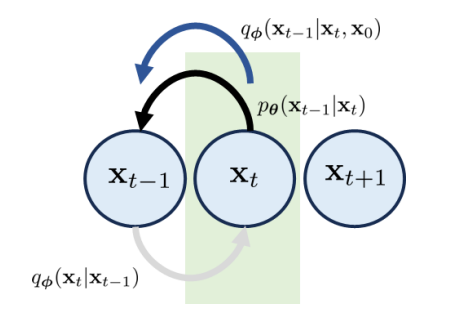
> A **problem** might be why don't we change $p_{\theta}$? The reason is that we need we don't know the distribution of $p_{\theta}(x_{0})$, but we can know $p_{\theta}(x_{T})$. This determines that $p_{\theta}$ can just be reverse process.

Then, the ELBO for a variational diffusion model is
$$
\begin{aligned}\mathrm{ELBO}_{\boldsymbol{\phi},\boldsymbol{\theta}}(\mathbf{x})&=\mathbb{E}_{q_{\boldsymbol{\phi}}(\mathbf{x}_{1}|\mathbf{x}_{0})}[\log\underbrace{p_{\boldsymbol{\theta}}(\mathbf{x}_{0}|\mathbf{x}_{1})}_{\mathrm{same~as~before}}]-\underbrace{\mathbb{D}_{\mathrm{KL}}\Big(q_{\boldsymbol{\phi}}(\mathbf{x}_{T}|\mathbf{x}_{0})\|p(\mathbf{x}_{T})\Big)}_{\mathrm{new~prior~matching}}\\&-\sum_{t=2}^T\mathbb{E}_{q_{\boldsymbol{\phi}}(\mathbf{x}_t|\mathbf{x}_0)}\Big[\underbrace{\mathbb{D}_{\mathrm{KL}}\Big(q_{\boldsymbol{\phi}}(\mathbf{x}_{t-1}|\mathbf{x}_t,\mathbf{x}_0)\|p_{\boldsymbol{\theta}}(\mathbf{x}_{t-1}|\mathbf{x}_t)\Big)}_{\mathrm{new~consistency}}\Big].\end{aligned}
$$

## 6 Derivation of $q_{\phi}(\mathbf{x}_{t-1}|\mathbf{x}_{t},\mathbf{x}_{0})$
The distribution $q_{\boldsymbol{\phi}}(\mathbf{x}_{t-1}|\mathbf{x}_{t},\mathbf{x}_{0})$ takes the form of
$$q_{\boldsymbol{\phi}}(\mathbf{x}_{t-1}|\mathbf{x}_t,\mathbf{x}_0)=\mathcal{N}(\mathbf{x}_{t-1}\:|\:\boldsymbol{\mu}_q(\mathbf{x}_t,\mathbf{x}_0),\boldsymbol{\Sigma}_q(t)),$$
where
$$
\begin{aligned}
\boldsymbol{\mu}_{q}(\mathbf{x}_{t},\mathbf{x}_{0})&=\frac{(1-\overline{\alpha}_{t-1})\sqrt{\alpha_{t}}}{1-\overline{\alpha}_{t}}\mathbf{x}_{t}+\frac{(1-\alpha_{t})\sqrt{\overline{\alpha}_{t-1}}}{1-\overline{\alpha}_{t}}\mathbf{x}_{0}\\\boldsymbol{\Sigma}_{q}(t)&=\frac{(1-\alpha_t)(1-\sqrt{\overline{\alpha}_{t-1}})}{1-\overline{\alpha}_t}\mathbf{I}\stackrel{\mathrm{def}}{=}\sigma_q^2(t)\mathbf{I}.
\end{aligned}
$$
> use the property of quadratic functions (assuming Gaussian first).

The interesting part is that $q_{\boldsymbol{\phi}}(\mathbf{x}_{t-1}|\mathbf{x}_t,\mathbf{x}_0)$ is completely characterized by $\mathbf{x}_{t}$ and $\mathbf{x}_{0}$. There is no neural network required to estimate the mean and variance! So, there is really nothing to “learn”.

To quickly calculate the KL divergence
$$
\mathbb{D}_{\mathrm{KL}}(\underbrace{q_{\boldsymbol{\phi}}(\mathbf{x}_{t-1}|\mathbf{x}_{t},\mathbf{x}_{0})}_{\text{nothing to learn}}\parallel\underbrace{p_{\boldsymbol{\theta}}(\mathbf{x}_{t-1}|\mathbf{x}_{t})}_{\text{need to do something}}),
$$
we assume $p_{\boldsymbol{\theta}}(\mathbf{x}_{t-1}|\mathbf{x}_{t})$ is also a Gaussian. To this end, we pick
$$
p_{\boldsymbol{\theta}}(\mathbf{x}_{t-1}|\mathbf{x}_{t})=\mathcal{N}\Big(\mathbf{x}_{t-1}|\underbrace{\boldsymbol{\mu}_{\boldsymbol{\theta}}(\mathbf{x}_{t})}_{\text{neural network}},\sigma_{q}^{2}(t)\mathbf{I}\Big),
$$
where we assume that **the mean vector** can be determined using a neural network. As for the variance, we choose the variance to be $\sigma_{q}^{2}(t)$. Now, we compare two distributions:
$$
\begin{aligned}
(\mathbf{x}_{t-1}|\mathbf{x}_{t},\mathbf{x}_{0})=\mathcal{N}\Big(\mathbf{x}_{t-1}\mid\underbrace{\boldsymbol{\mu}_{q}(\mathbf{x}_{t},\mathbf{x}_{0})}_{\mathrm{known}},\underbrace{\sigma_{q}^{2}(t)\mathbf{I}}_{\mathrm{known}}\Big),\\p_{\boldsymbol{\theta}}(\mathbf{x}_{t-1}|\mathbf{x}_{t})=\mathcal{N}\Big(\mathbf{x}_{t-1}|\underbrace{\boldsymbol{\mu}_{\boldsymbol{\theta}}(\mathbf{x}_{t})}_{\mathrm{neural~network}},\underbrace{\sigma_{q}^{2}(t)\mathbf{I}}_{\mathrm{known}}\Big).
\end{aligned}
$$

Therefore, the KL divergence is simplified to
$$
\begin{aligned}&\mathbb{D}_{\mathrm{KL}}\Big(q_{\boldsymbol{\phi}}(\mathbf{x}_{t-1}|\mathbf{x}_t,\mathbf{x}_0)\|p_{\boldsymbol{\theta}}(\mathbf{x}_{t-1}|\mathbf{x}_t)\Big)\\&=\mathbb{D}_{\mathrm{KL}}\Big(\mathcal{N}(\mathbf{x}_{t-1}\mid\boldsymbol{\mu}_q(\mathbf{x}_t,\mathbf{x}_0),\sigma_q^2(t)\mathbf{I})\|\mathcal{N}(\mathbf{x}_{t-1}\mid\boldsymbol{\mu}_{\boldsymbol{\theta}}(\mathbf{x}_t),\sigma_q^2(t)\mathbf{I})\Big)\\&=\frac1{2\sigma_q^2(t)}\|\boldsymbol{\mu}_q(\mathbf{x}_t,\mathbf{x}_0)-\boldsymbol{\mu}_{\boldsymbol{\theta}}(\mathbf{x}_t)\|^2,\end{aligned}
$$
where we used the fact that the KL divergence between two identical-variance Gaussians is just the Euclidean distance square between the two mean vectors.
If we go back to the definition of ELBO , we can rewrite it as
$$
\begin{aligned}\operatorname{ELBO}_{\boldsymbol{\theta}}(\mathbf{x})&=\mathbb{E}_{q(\mathbf{x}_1|\mathbf{x}_0)}[\log p_{\boldsymbol{\theta}}(\mathbf{x}_0|\mathbf{x}_1)]-\underbrace{\mathbb{D}_{\mathrm{KL}}\left(q(\mathbf{x}_T|\mathbf{x}_0)\|p(\mathbf{x}_T)\right)}_{\text{nothing to train}}\\&-\sum_{t=2}^T\mathbb{E}_{q(\mathbf{x}_t|\mathbf{x}_0)}\bigg[\frac1{2\sigma_q^2(t)}\|\boldsymbol{\mu}_q(\mathbf{x}_t,\mathbf{x}_0)-\boldsymbol{\mu}_{\boldsymbol{\theta}}(\mathbf{x}_t)\|^2\bigg].\end{aligned}
$$
- Given $\mathbf{x}_t\sim q(\mathbf{x}_t|\mathbf{x}_0)$, we can calculate $\log p_{\boldsymbol{\theta}}(\mathbf{x}_0|\mathbf{x}_1)$, which is just $\log\mathcal{N}(\mathbf{x}_0|\boldsymbol{\mu}_{\boldsymbol{\theta}}(\mathbf{x}_1),\sigma_q^2(1)\mathbf{I}).$ So, as soon as we know $\mathbf{x}_1$, we can send it to a network $\boldsymbol\mu_{\theta}(\mathbf{x}_1)$ to return us a mean estimate. The mean estimate will then be used to compute the likelihood.

## 7 Training and Inference
The ELBO suggests that we need to find a network $\boldsymbol{\mu_\mathrm{\theta}}$ that can somehow minimize this loss:
$$
\frac1{2\sigma_q^2(t)}\|\underbrace{\boldsymbol{\mu}_q(\mathbf{x}_t,\mathbf{x}_0)}_{\text{known}}-\underbrace{\boldsymbol{\mu}_{\boldsymbol{\theta}}(\mathbf{x}_t)}_{\text{network}}\|^2.
$$
We recall that
$$
\boldsymbol{\mu}_q(\mathbf{x}_t,\mathbf{x}_0)=\frac{(1-\overline{\alpha}_{t-1})\sqrt{\alpha_t}}{1-\overline{\alpha}_t}\mathbf{x}_t+\frac{(1-\alpha_t)\sqrt{\overline{\alpha}_{t-1}}}{1-\overline{\alpha}_t}\mathbf{x}_0.
$$
Since $\boldsymbol{\mu_{\theta}}$ is our $design$, there is no reason why we cannot define it as something more convenient. So here is an option:
$$
\underbrace{\boldsymbol{\mu_{\theta}}}_{\mathrm{a~network}}(\mathbf{x}_{t})\stackrel{\mathrm{def}}{=}\frac{(1-\overline{\alpha}_{t-1})\sqrt{\alpha_{t}}}{1-\overline{\alpha}_{t}}\mathbf{x}_{t}+\frac{(1-\alpha_{t})\sqrt{\overline{\alpha}_{t-1}}}{1-\overline{\alpha}_{t}}\underbrace{\widehat{\mathbf{x}}_{\boldsymbol{\theta}}(\mathbf{x}_{t})}_{\mathrm{another~network}}\:.
$$
Then we have
$$
\begin{aligned}\frac{1}{2\sigma_{q}^{2}(t)}\|\boldsymbol{\mu}_{q}(\mathbf{x}_{t},\mathbf{x}_{0})-\boldsymbol{\mu}_{\boldsymbol{\theta}}(\mathbf{x}_{t})\|^{2}&=\frac{1}{2\sigma_{q}^{2}(t)}\left\|\frac{(1-\alpha_{t})\sqrt{\overline{\alpha}_{t-1}}}{1-\overline{\alpha}_{t}}(\widehat{\mathbf{x}}_{\boldsymbol{\theta}}(\mathbf{x}_{t})-\mathbf{x}_{0})\right\|^{2}\\&=\frac1{2\sigma_q^2(t)}\frac{(1-\alpha_t)^2\overline{\alpha}_{t-1}}{(1-\overline{\alpha}_t)^2}\left\|\widehat{\mathbf{x}}_{\boldsymbol{\theta}}(\mathbf{x}_t)-\mathbf{x}_0\right\|^2\end{aligned}
$$
Therefore ELBO can be simplified into
$$
\begin{aligned}
\mathrm{ELBO}_{\boldsymbol{\theta}}& =\mathbb{E}_{q(\mathbf{x}_1|\mathbf{x}_0)}[\log p_{\boldsymbol{\theta}}(\mathbf{x}_0|\mathbf{x}_1)]-\sum_{t=2}^T\mathbb{E}_{q(\mathbf{x}_t|\mathbf{x}_0)}\Big[\frac1{2\sigma_q^2(t)}\|\boldsymbol{\mu}_q(\mathbf{x}_t,\mathbf{x}_0)-\boldsymbol{\mu}_{\boldsymbol{\theta}}(\mathbf{x}_t)\|^2\Big]  \\
&=\mathbb{E}_{q(\mathbf{x}_1|\mathbf{x}_0)}[\log p_{\boldsymbol{\theta}}(\mathbf{x}_0|\mathbf{x}_1)]-\sum_{t=2}^T\mathbb{E}_{q(\mathbf{x}_t|\mathbf{x}_0)}\Big[\frac1{2\sigma_q^2(t)}\frac{(1-\alpha_t)^2\overline{\alpha}_{t-1}}{(1-\overline{\alpha}_t)^2}\left\|\widehat{\mathbf{x}}_{\boldsymbol{\theta}}(\mathbf{x}_t)-\mathbf{x}_0\right\|^2\Big]. 
\end{aligned}
$$
The first term is
$$
\begin{aligned}
\\
\log p_{\boldsymbol{\theta}}(\mathbf{x}_0|\mathbf{x}_1)& =\log\mathcal{N}(\mathbf{x}_0|\boldsymbol{\mu}_{\boldsymbol{\theta}}(\mathbf{x}_1),\sigma_q^2(1)\mathbf{I})\propto-\frac{1}{2\sigma_q^2(1)}\|\boldsymbol{\mu}_{\boldsymbol{\theta}}(\mathbf{x}_1)-\mathbf{x}_0\|^2 && \text{definition}  \\
&=-\frac{1}{2\sigma_q^2(1)}\left\|\frac{(1-\overline{\alpha}_0)\sqrt{\alpha_1}}{1-\overline{\alpha}_1}\mathbf{x}_1+\frac{(1-\alpha_1)\sqrt{\overline{\alpha}_0}}{1-\overline{\alpha}_1}\widehat{\mathbf{x}}_{\boldsymbol{\theta}}(\mathbf{x}_1)-\mathbf{x}_0\right\|^2&& \mathrm{recall~}\alpha_{0}=1  \\
&=-\frac{1}{2\sigma_{q}^{2}(1)}\left\|\frac{(1-\alpha_{1})}{1-\overline{\alpha}_{1}}\widehat{\mathbf{x}}_{\boldsymbol{\theta}}(\mathbf{x}_{1})-\mathbf{x}_{0}\right\|^{2}=-\frac{1}{2\sigma_{q}^{2}(1)}\left\|\widehat{\mathbf{x}}_{\boldsymbol{\theta}}(\mathbf{x}_{1})-\mathbf{x}_{0}\right\|^{2}\quad\mathrm{recall~}\overline{\alpha}_{1}=\alpha_{1} \\
\end{aligned}
$$
Then ELBO will be
$$
\begin{aligned}
&\mathrm{ELBO}_{\boldsymbol{\theta}}=-\sum_{t=1}^T\mathbb{E}_{q(\mathbf{x}_t|\mathbf{x}_0)}\Big[\frac{1}{2\sigma_q^2(t)}\frac{(1-\alpha_t)^2\overline{\alpha}_{t-1}}{(1-\overline{\alpha}_t)^2}\left\|\widehat{\mathbf{x}}_{\boldsymbol{\theta}}(\mathbf{x}_t)-\mathbf{x}_0\right\|^2\Big].
\end{aligned}
$$
Therefore, the training of the neural network boils down to a simple loss function:

The loss function for a denoising diffusion probabilistic model:
$$
\boldsymbol{\theta}^*=\underset{\boldsymbol{\theta}}{\operatorname*{argmin}}\sum_{t=1}^T\frac1{2\sigma_q^2(t)}\frac{(1-\alpha_t)^2\overline{\alpha}_{t-1}}{(1-\overline{\alpha}_t)^2}\mathbb{E}_{q(\mathbf{x}_t|\mathbf{x}_0)}\bigg[\left\|\widehat{\mathbf{x}}_{\boldsymbol{\theta}}(\mathbf{x}_t)-\mathbf{x}_0\right\|^2\bigg].
$$
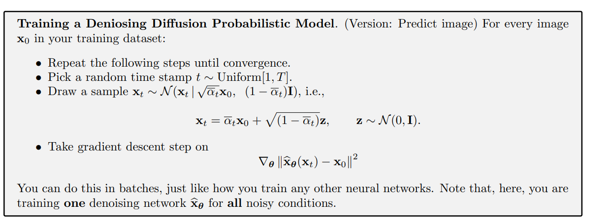
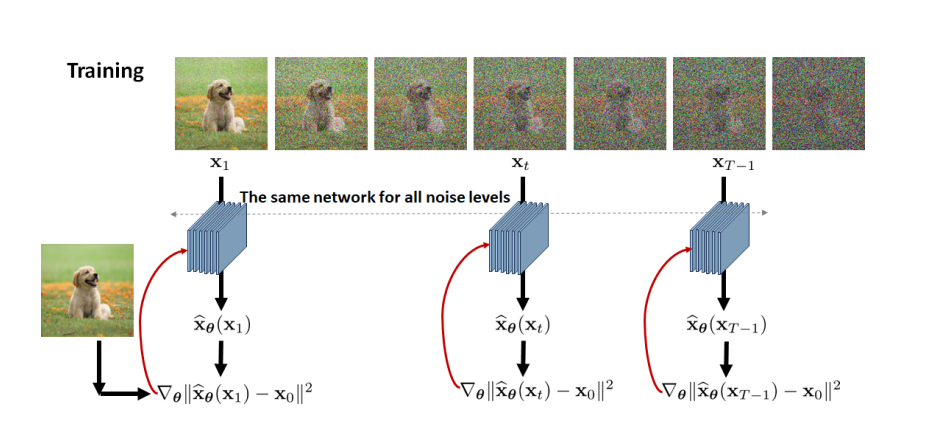

**Inference:** recursively
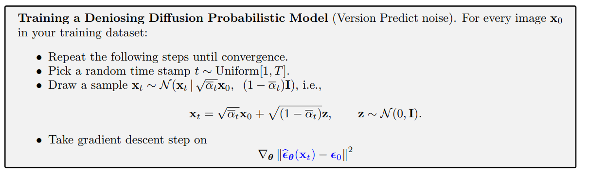
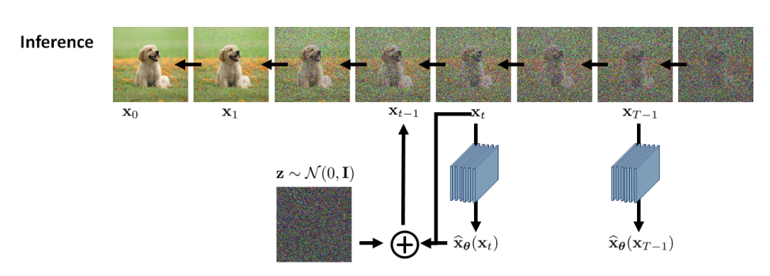

## 8 Derivation based on Noise Vector
We can show that
$$
\begin{aligned}
\boldsymbol{\mu}_q(\mathbf{x}_t,\mathbf{x}_0)
=\frac1{\sqrt{\alpha_t}}\mathbf{x}_t-\frac{1-\alpha_t}{\sqrt{1-\overline{\alpha}_t}\sqrt{\alpha}_t}\boldsymbol{\epsilon}_0.
\end{aligned}
$$
So we can design our mean estimator $\boldsymbol{\mu_{\theta}}$ with the form:
$$
\boldsymbol{\mu}_{\boldsymbol{\theta}}(\mathbf{x}_t)=\frac{1}{\sqrt{\alpha_t}}\mathbf{x}_t-\frac{1-\alpha_t}{\sqrt{1-\overline{\alpha}_t}\sqrt{\alpha}_t}\widehat{\boldsymbol{\epsilon}}_{\boldsymbol{\theta}}(\mathbf{x}_t).
$$
Then we can get a new ELBO
$$
\mathrm{ELBO}_{\boldsymbol{\theta}}=-\sum_{t=1}^T\mathbb{E}_{q(\mathbf{x}_t|\mathbf{x}_0)}\Big[\frac{1}{2\sigma_q^2(t)}\frac{(1-\alpha_t)^2\overline{\alpha}_{t-1}}{(1-\overline{\alpha}_t)^2}\left\|\widehat{\boldsymbol{\epsilon}}_{\boldsymbol{\theta}}(\mathbf{x}_t)-\boldsymbol{\epsilon}_0\right\|^2\Big].
$$
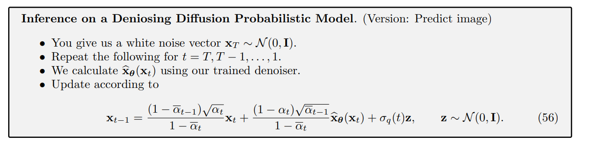
Consequently, the inference step can be derived through
$$
\begin{aligned}
\mathbf{x}_{t-1}\sim p_{\boldsymbol{\theta}}(\mathbf{x}_{t-1}\mid\mathbf{x}_{t})& =\mathcal{N}(\mathbf{x}_{t-1}\mid\boldsymbol{\mu}_{\boldsymbol{\theta}}(\mathbf{x}_t),\sigma_q^2(t)\mathbf{I})  \\
&=\mu_{\boldsymbol{\theta}}(\mathbf{x}_t)+\sigma_q^2(t)\mathbf{z} \\
&=\frac{1}{\sqrt{\alpha_{t}}}\mathbf{x}_{t}-\frac{1-\alpha_{t}}{\sqrt{1-\overline{\alpha}_{t}}\sqrt{\alpha}_{t}}\widehat{\boldsymbol{\epsilon}}_{\boldsymbol{\theta}}(\mathbf{x}_{t})+\sigma_{q}(t)\mathbf{z} \\
&=\frac1{\sqrt{\alpha_t}}\left(\mathbf{x}_t-\frac{1-\alpha_t}{\sqrt{1-\overline{\alpha}_t}}\widehat{\boldsymbol{\epsilon}}_{\boldsymbol{\theta}}(\mathbf{x}_t)\right)+\sigma_q(t)\mathbf{z}
\end{aligned}
$$
So we have
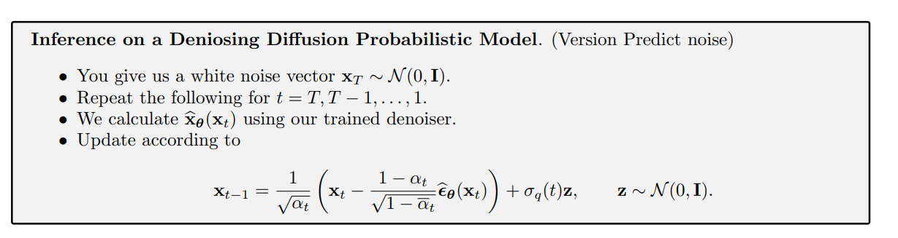

## Reference
[1] Chan, Stanley H. "Tutorial on Diffusion Models for Imaging and Vision." arXiv preprint arXiv:2403.18103 (2024).

