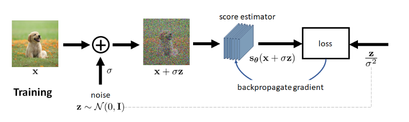

## 1 Langevin Dynamics

> [!NOTE] 
> **How to sample from a distribution**
> The Langevin dynamics for sampling from a known distribution $p(\mathbf{x})$ is an iterative procedure for $t=1,\ldots,T{:}$
> $$
> \mathbf{x}_{t+1}=\mathbf{x}_t+\tau\nabla_\mathbf{x}\log p(\mathbf{x}_t)+\sqrt{2\tau}\mathbf{z},\quad\mathbf{z}\sim\mathcal{N}(0,\mathbf{I}),
> $$
>  where $\tau$ is the step size which users can control, and $\mathbf{x}_0$ is white noise.
>  - Without the noise term, Langevin dynamics is **gradient descent**.

The intuition is that if we want to sample $\mathbf{x}$ from a distribution, certainly the "optimal" location for $\mathbf{x}$ is where $p(\mathbf{x})$ is maximized (seeing the peak as a representation of a distribution). So the goal of sampling is equivalent to solving the optimization
$$
\mathbf{x}^*=\underset{\mathbf{x}}{\operatorname*{argmax}} \log p(\mathbf{x}).
$$
> distribution <=> peak <=> optimal solution

> [!IMPORTANT] 
> Langevin dynamics is stochastic gradient descent.
> - We do stochastic gradient descent since we want to sample from a distribution, instead of solving the optimization problem.

## 2 (Stein’s) Score Function

The second component of the Langevin dynamics equation has a formal name known as the **Stein's score function**, denoted by
$$
\mathrm{s}_{\boldsymbol{\theta}}(\mathrm{x})\overset{\mathrm{def}}{\operatorname*{=}}\nabla_{\mathbf{x}}\log p_{\boldsymbol{\theta}}(\mathbf{x}).
$$
The way to understand the score function is to remember that it is the gradient with respect to the data
$\mathbf{x}.$ For any high-dimensional distribution $p(\mathbf{x})$, the gradient will give us vector field
$$\nabla_\mathbf{x}\log p(\mathbf{x})=\text{a vector field}=\begin{bmatrix}\frac{\partial\log p(\mathbf{x})}{\partial x},&\frac{\partial\log p(\mathbf{x})}{\partial y}\end{bmatrix}^T$$

**Geometric Interpretations of the Score Function:**
- The magnitude of the vectors are the strongest at places where the change of $\log p(\mathbf{x})$ is the biggest. Therefore, in regions where $\log p(\mathbf{x})$ is close to the peak will be mostly very weak gradient.
- The vector field indicates how a data point should travel in the contour map. 
- In physics, the score function is equivalent to the "drift". This name suggests how the diffusion particles
should flow to the lowest energy state.

## 3 Score Matching Techniques
Note that since the distribution is not known, we need some methods to approximate it.
### Explicit Score-Matching
Suppose that we are given a dataset $\mathcal{X}=\{\mathbf{x}_1,\ldots,\mathbf{x}_M\}.$ The solution people came up with is to consider the classical kernel density estimation by defining a distribution
$$
q(\mathbf{x})=\frac1M\sum_{m=1}^M\frac1hK\left(\frac{\mathbf{x}-\mathbf{x}_m}h\right),
$$
where $h$ is just some hyperparameter for the kernel function $K(\cdot)$, and $\mathbf{x}_m$ is the $m$-th sample in the training set. 

- The sum of all these individual kernels gives us the overall kernel density estimate $q(\mathbf{x}).$ 
- The idea is similar to Gaussian Mixture Model.

Since $q(\mathbf{x})$ is an approximation to $p(\mathbf{x})$ which is never accessible, we can learn s$_{\boldsymbol{\theta}}(\mathbf{x})$ based on $q(\mathbf{x}).$ This leads to the following definition of the a loss function which can be used to train a network.

> [!IMPORTANT]
> The **explicit score matching loss** is
> $$
> J_{\mathrm{ESM}}(\boldsymbol{\theta})\stackrel{\mathrm{def}}{=}\mathbb{E}_{q(\mathbf{x})}\|\mathrm{s}_{\boldsymbol{\theta}}(\mathbf{x})-\nabla_{\mathbf{x}}\log q(\mathbf{x})\|^2
> $$

By substituting the kernel density estimation, we can show that the loss is
$$
\begin{aligned}
J_{\mathrm{ESM}}(\theta  )&\stackrel{\mathrm{def}}{=}\mathbb{E}_{q(\mathbf{x})}\|\mathrm{s}_{\boldsymbol{\theta}}(\mathbf{x})-\nabla_{\mathbf{x}}\log q(\mathbf{x})\|^2 \\
&=\int\|\mathrm{s}_{\boldsymbol{\theta}}(\mathbf{x})-\nabla_{\mathbf{x}}\log q(\mathbf{x})\|^2\left[\frac1M\sum_{m=1}^M\frac1hK\left(\frac{\mathbf{x}-\mathbf{x}_m}h\right)\right]d\mathbf{x} \\
&=\frac1M\sum_{m=1}^M\int\|\mathbf{s}_{\boldsymbol{\theta}}(\mathbf{x})-\nabla_{\mathbf{x}}\log q(\mathbf{x})\|^2\frac1hK\left(\frac{\mathbf{x}-\mathbf{x}_m}h\right)d\mathbf{x}.
\end{aligned}
$$
Once we train the network s$_{\boldsymbol{\theta}}$, we can replace it in the Langevin dynamics equation to obtain the recursion:
$$
\mathbf{x}_{t+1}=\mathbf{x}_t+\tau\mathbf{s}_{\boldsymbol{\theta}}(\mathbf{x}_t)+\sqrt{2\tau}\mathbf{z}.
$$
Issue:
- The kernel density estimation is a fairly poor non-parameter estimation of the true distribution.
- When we have limited number of samples and the samples live in a high dimensional space, the kernel density estimation performance can be poor.

### Denoising Score Matching
In DSM, the loss function is defined as follows.
$$
J_{\mathrm{DSM}}(\boldsymbol{\theta})\stackrel{\mathrm{def}}{=}\mathbb{E}_{q(\mathbf{x},\mathbf{x}^{\prime})}\left[\frac12\left\|\mathbf{s}_{\boldsymbol{\theta}}(\mathbf{x})-\nabla_{\mathbf{x}}q(\mathbf{x}|\mathbf{x}^{\prime})\right\|^2\right]
$$
The conditional distribution $q(\mathbf{x}|\mathbf{x}^{\prime})$ does not require an approximation. In the special case where $q(\mathbf{x}|\mathbf{x}^{\prime})=\mathcal{N}(\mathbf{x}\mid\mathbf{x}^{\prime},\sigma^2)$, we can let $\mathbf{x}=\mathbf{x}^\prime+\sigma\mathbf{z}.$ This will give us
$$
\begin{aligned}
\nabla_{\mathbf{x}}\log q(\mathbf{x}|\mathbf{x}^{\prime})&=\nabla_{\mathbf{x}}\log\frac1{(\sqrt{2\pi\sigma^2})^d}\exp\left\{-\frac{\|\mathbf{x}-\mathbf{x}^{\prime}\|^2}{2\sigma^2}\right\}\\&=\nabla_\mathbf{x}\left\{-\frac{\|\mathbf{x}-\mathbf{x}^{\prime}\|^2}{2\sigma^2}-\log(\sqrt{2\pi\sigma^2})^d\right\}\\&=-\frac{\mathbf{x}-\mathbf{x}^{\prime}}{\sigma^2}=-\frac{\mathbf{z}}{\sigma^2}.
\end{aligned}
$$
As a result, the loss function of the denoising score matching becomes
$$\begin{aligned}J_{\mathrm{DSM}}(\boldsymbol{\theta})&\stackrel{\mathrm{def}}{=}\mathbb{E}_{q(\mathbf{x},\mathbf{x}^{\prime})}\left[\frac12\left\|\mathbf{s}_{\boldsymbol{\theta}}(\mathbf{x})-\nabla_{\mathbf{x}}q(\mathbf{x}|\mathbf{x}^{\prime})\right\|^2\right]\\&=\mathbb{E}_{q(\mathbf{x}^{\prime})}\left[\frac12\left\|\mathbf{s}_{\boldsymbol{\theta}}(\mathbf{x}^{\prime}+\sigma\mathbf{z})+\frac{\mathbf{z}}{\sigma^2}\right\|^2\right].\end{aligned}$$
> The gradient operation cancels $\mathbf{x}$.

- The quantity $\mathbf{x}+\sigma\mathbf{z}$ is effectively adding noise $\sigma\textbf{z}$  to a clean image $\mathbf{x}$. 
- The score function $s_{{\boldsymbol{\theta}}}$ is supposed to take this noisy image and predict the noise $\frac {\mathbf{z} }{\sigma ^2}.$ 
- Predicting noise is equivalent to denoising, because any denoised image plus the predicted noise will give us the noisy observation. 

> [!CAUTION] 
> **Why we can assume $q(\mathbf{x}|\mathbf{x}')$ is Gaussian distribution?**
> My understanding:
> - Since $\mathbf{x}$ and $\mathbf{x}'$ follows from the same distribution, the error can just be modeled as the gaussian noise.
> - TBD

The **training** step can simply described as follows: You give us a training dataset $\{\mathbf{x}^{(\ell)}\}_{\ell=1}^L$, we train a network $\boldsymbol{\theta}$ with the goal to
$$
\theta^*=\underset{\boldsymbol{\theta}}{\operatorname*{argmin}}\quad\frac1L\sum_{\ell=1}^L\frac12\left\|\mathbf{s}_{\boldsymbol{\theta}}\left(\mathbf{x}^{(\ell)}+\sigma\mathbf{z}^{(\ell)}\right)+\frac{\mathbf{z}^{(\ell)}}{\sigma^2}\right\|^2,\quad\mathrm{where}\quad\mathbf{z}^{(\ell)}\sim\mathcal{N}(0,\mathbf{I}).
$$

The last thing is that why the loss function of DSM makes sense?

> [!IMPORTANT] 
> **Theorem** For up to a constant $C$ which is independent of the variable $\boldsymbol{\theta}$, it holds that
> $$
> J_{\mathrm{DSM}}(\theta)=J_{\mathrm{ESM}}(\theta)+C.
> $$

The proof is not hard.

For **inference**, we assume that we have already trained the score estimator s$_{\boldsymbol{\theta}}.$ To generate an image, we perform the following procedure for $t=1,\ldots,T{:}$
$$
\mathbf{x}_{t+1}=\mathbf{x}_t+\tau\mathbf{s}_{\boldsymbol{\theta}}(\mathbf{x}_t)+\sqrt{2\tau}\mathbf{z}_t,\quad\mathrm{where}\quad\mathbf{z}_t\sim\mathcal{N}(0,\mathbf{I}).
$$
## Reference

[1] Chan, Stanley H. "Tutorial on Diffusion Models for Imaging and Vision." arXiv preprint arXiv:2403.18103 (2024).

