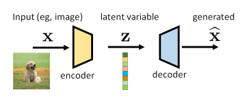
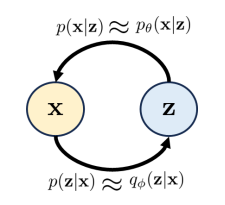

VAE can be considered as an encoder-decoder pair, the structure of which is shown as follows.

"Variational" comes from the fact that we use probability distribution to describe $\mathbf{x}$ and $\mathbf{z}$. To see more details, we need to consider following distributions:
- $p(\mathbf{x})$: The distribution of $\mathbf{x}$.
- $p(\mathbf{z})$: The distribution of latent variable. We make it a Gaussian $p(\mathbf{z})\sim \mathcal{N}(0, \mathbf{I})$.
- $p(\mathbf{z}|\mathbf{x})$: The conditional distribution associated with the **encoder**.
- $p(\mathbf{x}|\mathbf{z})$: The conditional distribution associated with the **decoder**.

In practice, people often use the following two proxy distributions:
- $q_{\phi}(\mathbf{z}|\mathbf{x})$: The proxy for $p(\mathbf{z}|\mathbf{x})$. We will make it Gaussian.
- $p_{\theta}(\mathbf{x}|\mathbf{z})$: The proxy for $p(\mathbf{x}|\mathbf{z})$. We will also make it Gaussian. We don't need to estimate anything for the Gaussian $p_{\theta}(\mathbf{x}|\mathbf{z})$. Instead, we just use a decoder neural network to turn $\mathbf{z}$ back into $\mathbf{x}$.

## Evidence Lower Bound (ELBO)
$$
\text{ELBO}(\mathbf{x}) \overset{\text{def}}{=} \mathbb{E}_{q_{\phi}(\mathbf{z}|\mathbf{x})}\left[ \log \frac{p(\mathbf{x},\mathbf{z})}{q_{\phi}(\mathbf{z}|\mathbf{x})} \right]
$$
ELBO is a **lower bound** for the prior distribution $\log p(\mathbf{x})$. We can see that 
$$
\begin{align}
\log p(x) &= \mathbb{E}_{q_{\phi}(\mathbf{z}|\mathbf{x})}[\log p(x)] \\
&=\mathbb{E}_{q_{\phi}(\mathbf{z}|\mathbf{x})}\left[ \log \frac{p(x,z)}{p(\mathbf{z}|\mathbf{x})} \right] \\
&=\mathbb{E}_{q_{\phi}(\mathbf{z}|\mathbf{x})}\left[ \log \frac{p(x,z)}{p(\mathbf{z}|\mathbf{x})} \times \frac{{q_{\phi}(\mathbf{z}|\mathbf{x})}}{q_{\phi}(\mathbf{z}|\mathbf{x})} \right] \\
&=\mathbb{E}_{q_{\phi}(\mathbf{z}|\mathbf{x})}\left[ \log \frac{p(\mathbf{x},\mathbf{z})}{q_{\phi}(\mathbf{z}|\mathbf{x})} \right] + \mathbb{E}_{q_{\phi}(\mathbf{z}|\mathbf{x})}\left[ \log \frac{q_{\phi}(\mathbf{z}|\mathbf{x})}{p(\mathbf{z}|\mathbf{x})} \right] \\
&=\text{ELBO}(x) + \mathbb{D}_{\text{KL}}(q_{\phi}(\mathbf{z}|\mathbf{x})||p(\mathbf{z}|\mathbf{x})) \\
&\geq \text{ELBO}(x)
\end{align}
$$
To make it more useful in practice, we use some tricks
$$
\begin{align}
\text{ELBO}(\mathbf{x}) &\overset{\text{def}}{=}\mathbb{E}_{q_{\phi}(\mathbf{z}|\mathbf{x})}\left[ \log \frac{p(\mathbf{x},\mathbf{z})}{q_{\phi}(\mathbf{z}|\mathbf{x})} \right] \\
&=\mathbb{E}_{q_{\phi}(\mathbf{z}|\mathbf{x})}\left[ \log \frac{{p(\mathbf{x|z}) p(\mathbf{z})}}{q_{\phi}(\mathbf{z|x})} \right] \\
&=\mathbb{E}_{q_{\phi}(\mathbf{z}|\mathbf{x})}[\log p(\mathbf{x|z})]+\mathbb{E}_{q_{\phi}(\mathbf{z}|\mathbf{x})}\left[ \log \frac{p(\mathbf{z})}{q_{\phi}(\mathbf{z|x})} \right] \\
&=\mathbb{E}_{q_{\phi}(\mathbf{z}|\mathbf{x})}[\log p_{\theta}(\mathbf{x|z})]-\mathbb{D}_{\text{KL}}(q_{\phi}(\mathbf{z}|\mathbf{x})||p(\mathbf{z}))
\end{align}
$$
## Training VAE and Loss Function
Let's look at the **decoder**.
$$
\hat{\mathbf{x}}=\text{decode}_{\theta}(\mathbf{z})
$$
we make one more assumption that the error between the decoded image $\hat{\mathbf{x}}$ and the ground truth image $\mathbf{x}$ is Gaussian, which is $(\hat{\mathbf{x}}-\mathbf{x}) \sim \mathcal{N}(0, \sigma^{2}_{\text{dec}})$ for some $\sigma^{2}_{\text{dec}}$. Then, it follows that the distribution $p_{\theta}(\mathbf{x}|\mathbf{z})$ is
$$
\begin{aligned}\log p_{\boldsymbol{\theta}}(\mathbf{x}|\mathbf{z})&=\log\mathcal{N}(\mathbf{x}\mid\mathrm{decode}_{\boldsymbol{\theta}}(\mathbf{z}),\sigma_{\mathrm{dec}}^{2}\mathbf{I})\\&=\log\frac{1}{\sqrt{(2\pi\sigma_{\mathrm{dec}}^{2})^{D}}}\exp\left\{-\frac{\|\mathbf{x}-\mathrm{decode}_{\boldsymbol{\theta}}(\mathbf{z})\|^{2}}{2\sigma_{\mathrm{dec}}^{2}}\right\}\\&=-\frac{\|\mathbf{x}-\mathrm{decode}_{\boldsymbol{\theta}}(\mathbf{z})\|^{2}}{2\sigma_{\mathrm{dec}}^{2}}-\underbrace{\log\sqrt{(2\pi\sigma_{\mathrm{dec}}^{2})^{D}}}_{\text{you can ignore this term}}\end{aligned}
$$
It is just the $\mathcal{l}_{2}$ loss between the decoded image and ground truth.

We approximate the expectation by Monte-Carlo simulation, then the loss function is 

**Training loss of VAE:**
$$
\operatorname*{argmax}_{\boldsymbol{\phi},\boldsymbol{\theta}}\left\{\frac{1}{L}\sum_{\ell=1}^{L}\log p_{\boldsymbol{\theta}}(\mathbf{x}^{(\ell)}|\mathbf{z}^{(\ell)})-\mathbb{D}_{\mathrm{KL}}(q_{\boldsymbol{\phi}}(\mathbf{z}|\mathbf{x}^{(\ell)})\|p(\mathbf{z}))\right\}
$$
What's more, the KL divergence for two $d$-dimensional Gaussian distribution $\mathcal{N}(\boldsymbol{\mu}_{0},\boldsymbol{\Sigma}_{0})$ and $\mathcal{N}(\boldsymbol{\mu}_{1},\boldsymbol{\Sigma}_{1})$ is
$$
\mathbb{D}_{\mathrm{KL}}(\mathcal{N}(\boldsymbol{\mu}_0,\boldsymbol{\Sigma}_0),\mathcal{N}(\boldsymbol{\mu}_1,\boldsymbol{\Sigma}_1))=\frac{1}{2}\left(\mathrm{Tr}(\boldsymbol{\Sigma}_1^{-1}\boldsymbol{\Sigma}_0)-d+(\boldsymbol{\mu}_1-\boldsymbol{\mu}_0)^T\boldsymbol{\Sigma}_1^{-1}(\boldsymbol{\mu}_1-\boldsymbol{\mu}_0)+\log\frac{\mathrm{det}\boldsymbol{\Sigma}_1}{\mathrm{det}\boldsymbol{\Sigma}_0}\right)
$$
In our case, it can be simplified as follows:
$$
\mathbb{D}_{\mathrm{KL}}(q_{\boldsymbol{\phi}}(\mathbf{z}|\mathbf{x}^{(\ell)})\parallel p(\mathbf{z}))=\frac{1}{2}\left((\sigma_{\boldsymbol{\phi}}^{2}(\mathbf{x}^{(\ell)}))^{d}+\boldsymbol{\mu}_{\boldsymbol{\phi}}(\mathbf{x}^{(\ell)})^{T}\boldsymbol{\mu}_{\boldsymbol{\phi}}(\mathbf{x}^{(\ell)})-d\log(\sigma_{\boldsymbol{\phi}}^{2}(\mathbf{x}^{(\ell)}))\right)
$$

## Reference
[1] Chan, Stanley H. "Tutorial on Diffusion Models for Imaging and Vision." arXiv preprint arXiv:2403.18103 (2024).