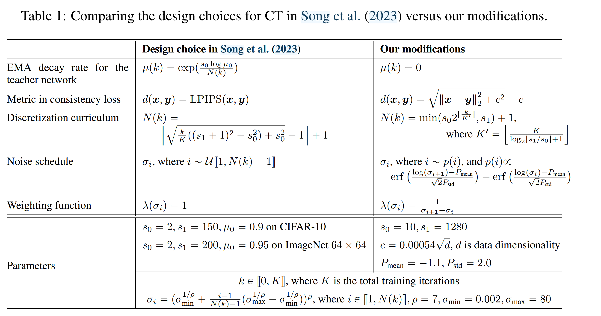

This paper focuses on consistency training. The main changes are shown in the table.

## 1 Weighting Function, Noise Embedding, and Dropout

The default weighting function $\lambda(\sigma) \equiv 1$ assigns equal weights to all noise levels but is suboptimal. The paper refines this by introducing $\lambda(\sigma_i) = \frac{1}{\sigma_{i+1} - \sigma_i}$, which decreases as noise increases. This prioritizes smaller noise levels, improving sample quality in CT with the squared $\ell_2$ metric.

Song et al. (2023) use Fourier embeddings for CIFAR-10 and positional embeddings for ImageNet, balancing sensitivity to noise differences with training stability. Excessive sensitivity can cause divergence in continuous-time CT, which they address by pre-training with a diffusion model. This work shows that **continuous-time CT can also converge with random initialization by reducing the Fourier scale parameter, improving stability.** For discrete-time CT, reduced sensitivity slightly improves FIDs on CIFAR-10, and ImageNet models use default positional embeddings due to their comparable sensitivity to Fourier embeddings with a scale of 0.02.

Song et al. (2023) use zero dropout for consistency models, assuming single-step sampling reduces overfitting. However, **higher dropout rates improve sample quality**. Synchronizing dropout RNGs across student and teacher networks further stabilizes CT optimization.

With refined weighting functions, noise embeddings, and dropout, the sample quality of consistency models under the squared $\ell_2$ metric improves significantly.

## 2 Removing EMA for the Teacher Network
1. For CT, the EMA decay rate for the teacher network should always be set to zero, although it can be non-zero for CD. 
2. Omitting EMA from the teacher network in CT significantly improves the sample quality of consistency models.
3. Only when $\mu(k) \equiv 0$ does the objective of CT converge to that of the CM as $N \to \infty$.

## 3 Pseudo-Huber Metric Functions

This paper employs the Pseudo-Huber metric family, defined as  
$$  
d(\boldsymbol{x}, \boldsymbol{y}) = \sqrt{\|\boldsymbol{x} - \boldsymbol{y}\|_2^2 + c^2} - c,  
$$ 
where $c > 0$ is an adjustable parameter. The Pseudo-Huber metric provides a smooth interpolation between the $\ell_1$ and squared $\ell_2$ norms, with $c$ controlling the width of the parabolic transition region. It is twice continuously differentiable, satisfying the theoretical requirements for CT.

The paper suggests that $c$ should scale linearly with $\|\boldsymbol{x} - \boldsymbol{y}\|_2$ and proposes a heuristic  
$$  
c = 0.00054\sqrt{d},  
$$  
where $d$ is the dimensionality of the image.

## 4 Improved Curriculum for Total Discretization Steps

CT's theoretical foundation holds asymptotically as $N \rightarrow \infty$. In practice, we have to select a finite $N$ for training consistency models, potentially introducing bias into the learning process. This paper uses an exponentially increasing curriculum for the total discretization steps $N$, doubling $N$ after a set number of training iterations. Specifically, the curriculum is described by

$$
N(k)=\min \left(s_0 2^{\left\lfloor\frac{k}{K^{\prime}}\right\rfloor}, s_1\right)+1, \quad K^{\prime}=\left\lfloor\frac{K}{\log _2\left\lfloor s_1 / s_0\right\rfloor+1}\right\rfloor
$$

 The sample quality of consistency models improves predictably as $N$ increases. While larger $N$ can reduce bias in CT, they might increase variance. On the contrary, smaller $N$ reduces variance at the cost of higher bias. We cap $N$ at 1281 in $N(k)$, which we empirically find to strike a good balance between bias and variance. In our experiments, we set $s_0$ and $s_1$ in discretization curriculums from their default values of 2 and 150 in Song et al. (2023) to $s_0=10$ and $s_1=1280$ respectively.
## 5 Improved Noise Schedulers

Song (2023) proposes sampling a random $i$ from $\mathcal{U}[1, N-1]$ to select $\sigma_i$ and $\sigma_{i+1}$ for computing the CT objective. The noise levels are defined as:

$$
\sigma_i = \left( \sigma_{\min}^{1/\rho} + \frac{i-1}{N-1} (\sigma_{\max}^{1/\rho} - \sigma_{\min}^{1/\rho}) \right)^\rho.
$$

As $N \to \infty$, the distribution of $\sigma$ converges to:

$$
p(\log \sigma) = \sigma \frac{\sigma^{1/\rho - 1}}{\rho (\sigma_{\max}^{1/\rho} - \sigma_{\min}^{1/\rho})}.
$$

This derivation uses the formula $p(\sigma) = p(x) \cdot \left|\frac{dx}{d\sigma}\right|$, where $x = \frac{i-1}{N-1} \sim U(0, 1)$ as $N \to \infty$.

The resulting distribution favors higher values of $\log \sigma$, which biases the sampling process. To address this, this paper adopt a **lognormal distribution** with a mean of $-1.1$ and standard deviation of $2.0$. This adjustment reduces the emphasis on high noise levels while also moderating the focus on smaller ones, which benefits learning due to the inductive bias of the consistency model's parameterization.

For practical implementation, we discretize the lognormal distribution over $\{\sigma_1, \sigma_2, \ldots, \sigma_N\}$ as:

$$
p(\sigma_i) \propto \operatorname{erf}\left(\frac{\log \sigma_{i+1} - P_{\text{mean}}}{\sqrt{2} P_{\text{std}}}\right) - \operatorname{erf}\left(\frac{\log \sigma_i - P_{\text{mean}}}{\sqrt{2} P_{\text{std}}}\right),
$$

where $P_{\text{mean}} = -1.1$ and $P_{\text{std}} = 2.0$. 
